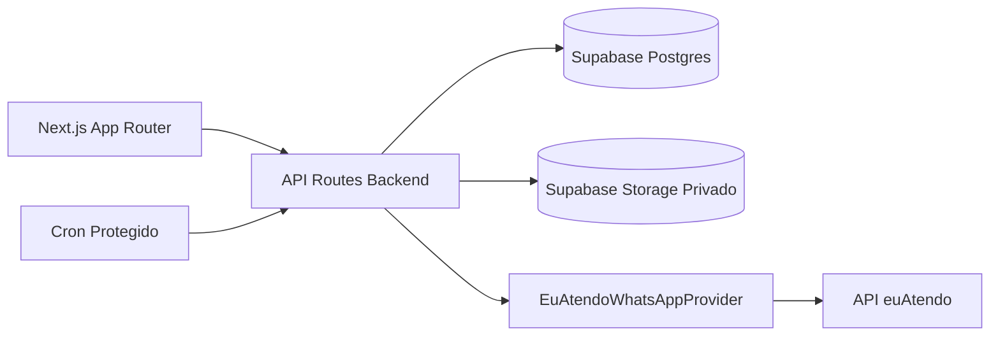

# Arquitetura

Componentes principais:

- Frontend: Server Components e Client Components isolados.
- Backend: API Routes Node.js para certificados, links, avisos e euAtendo.
- Banco: Supabase Postgres com RLS, funções e RPCs.
- Storage: bucket privado `certificados-pfx`.
- WhatsApp: Canal WhatsApp euAtendo via backend server-only.
