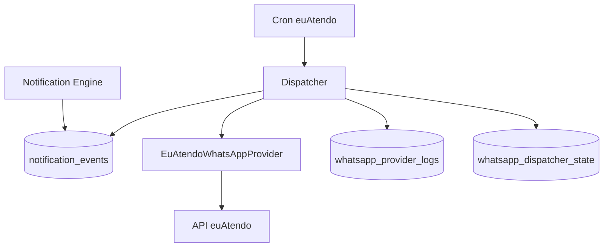
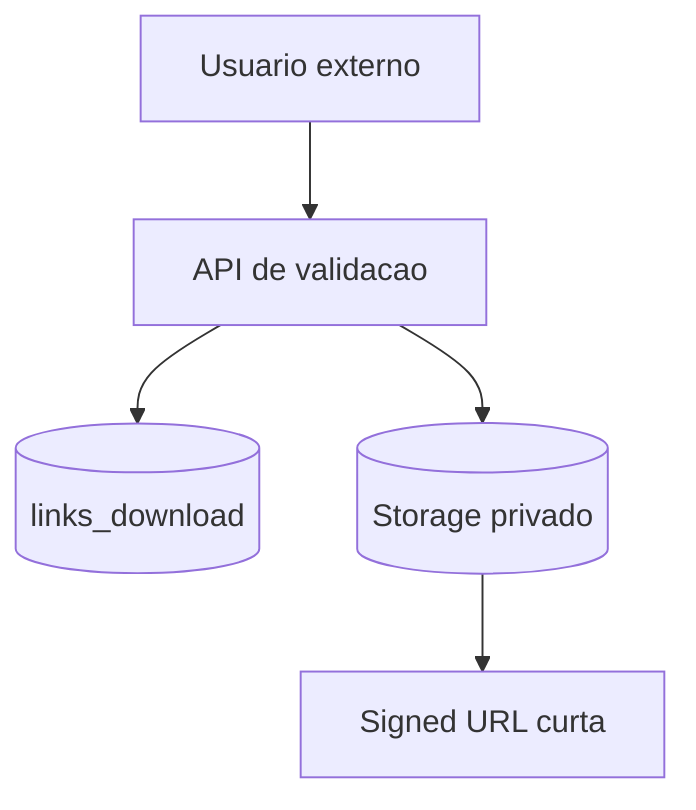

# Diagramas

## Canal WhatsApp

```mermaid
flowchart TD
  Engine[Notification Engine] --> Events[(notification_events)]
  Cron[Cron euAtendo] --> Dispatcher[Dispatcher]
  Dispatcher --> Events
  Dispatcher --> Provider[EuAtendoWhatsAppProvider]
  Provider --> API[API euAtendo]
  Dispatcher --> Logs[(whatsapp_provider_logs)]
  Dispatcher --> State[(whatsapp_dispatcher_state)]
```

## Download Publico

```mermaid
flowchart TD
  Publico[Usuario externo] --> Backend[API de validacao]
  Backend --> DB[(links_download)]
  Backend --> Storage[(Storage privado)]
  Storage --> Signed[Signed URL curta]
```
